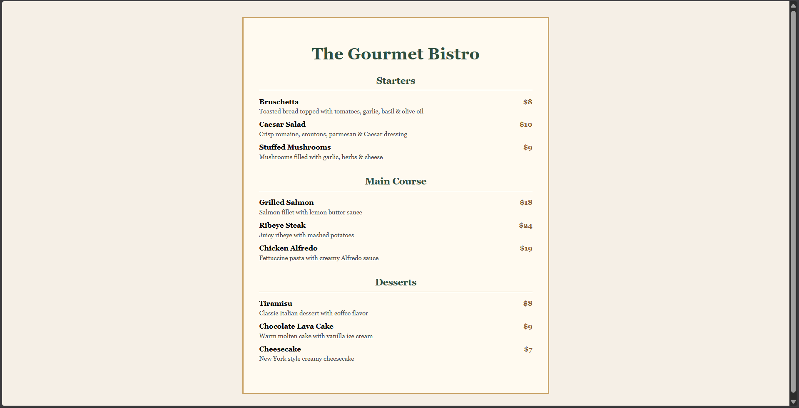

# Web-Task2-
A collection of beginner to advanced HTML &amp; CSS practice tasks and mini projects for improving front-end development skills.

---

# 🍽️ Restaurant Menu Web Page

A simple and elegant **Restaurant Menu webpage** created using **HTML & CSS**.  
This project demonstrates basic web layout design, styling, spacing, and content organization.

---

## 📌 Features

- Restaurant name displayed at the top
- Three menu sections:
  - 🥗 Starters  
  - 🍝 Main Course  
  - 🍰 Desserts
- Prices aligned neatly to the right
- Clean typography using CSS fonts
- Proper spacing and color styling
- Fully responsive-friendly structure

---

## 🛠️ Technologies Used

- **HTML5** — for page structure  
- **CSS3** — for design, layout, colors, fonts, and spacing

---

## 📂 Project Structure

###  HTML

```
<!DOCTYPE html>
<html lang="en">
<head>
<meta charset="UTF-8">
<title>The Gourmet Bistro</title>
<link rel="stylesheet" href="task2.css">
</head>
<body>

<div class="menu">

<h1>The Gourmet Bistro</h1>

<section>
<h2>Starters</h2>

<div class="item">
  <span>Bruschetta</span>
  <span class="price">$8</span>
</div>
<p>Toasted bread topped with tomatoes, garlic, basil & olive oil</p>

<div class="item">
  <span>Caesar Salad</span>
  <span class="price">$10</span>
</div>
<p>Crisp romaine, croutons, parmesan & Caesar dressing</p>

<div class="item">
  <span>Stuffed Mushrooms</span>
  <span class="price">$9</span>
</div>
<p>Mushrooms filled with garlic, herbs & cheese</p>
</section>

<section>
<h2>Main Course</h2>

<div class="item">
  <span>Grilled Salmon</span>
  <span class="price">$18</span>
</div>
<p>Salmon fillet with lemon butter sauce</p>

<div class="item">
  <span>Ribeye Steak</span>
  <span class="price">$24</span>
</div>
<p>Juicy ribeye with mashed potatoes</p>

<div class="item">
  <span>Chicken Alfredo</span>
  <span class="price">$19</span>
</div>
<p>Fettuccine pasta with creamy Alfredo sauce</p>
</section>

<section>
<h2>Desserts</h2>

<div class="item">
  <span>Tiramisu</span>
  <span class="price">$8</span>
</div>
<p>Classic Italian dessert with coffee flavor</p>

<div class="item">
  <span>Chocolate Lava Cake</span>
  <span class="price">$9</span>
</div>
<p>Warm molten cake with vanilla ice cream</p>

<div class="item">
  <span>Cheesecake</span>
  <span class="price">$7</span>
</div>
<p>New York style creamy cheesecake</p>
</section>

</div>

</body>
</html>

```

### CSS
```
body {
    background: #f5efe6;
    font-family: 'Georgia', serif;
}

.menu {
    width: 700px;
    background: #fffaf0;
    margin: 40px auto;
    padding: 40px;
    border: 4px solid #c8a165;
}

h1 {
    text-align: center;
    font-size: 42px;
    color: #2f4f3f;
    margin-bottom: 30px;
}

section {
    margin-bottom: 40px;
}

h2 {
    text-align: center;
    color: #2f4f3f;
    border-bottom: 2px solid #c8a165;
    padding-bottom: 10px;
    margin-bottom: 20px;
}

.item {
    display: flex;
    justify-content: space-between;
    font-weight: bold;
    font-size: 18px;
}

.price {
    color: #8b5a2b;
}

p {
    margin: 5px 0 15px 0;
    color: #444;
}
```

## 📸 PREVIEW


